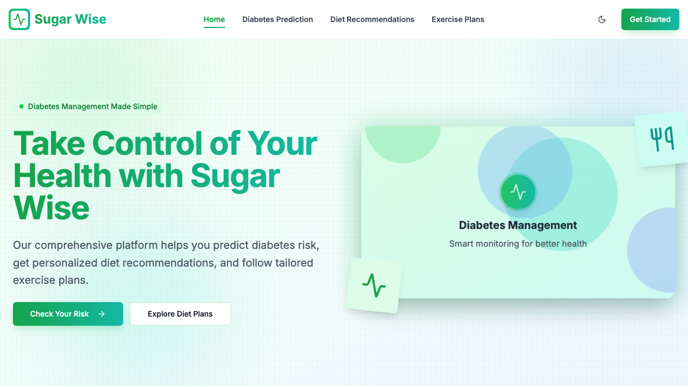

# Collage-hackathon
# Sugar Wise 🌿

**Predict | Plan | Prevent**

Sugar Wise is a modern, responsive web application designed to help users assess their risk of diabetes and receive personalized recommendations for diet and exercise. This project combines a clean UI, interactive tools, and dynamic APIs to empower users to manage their health proactively.

---

## 🔗 Live Demo

Visit the website: [Sugar Wise Homepage](https://csd-sugar-wise.vercel.app/)

---

## 📂 Project Structure & Navigation

The website follows a clear and intuitive structure to guide users through key features:

- **Home:** Overview of features and introduction.
- **Diabetes Prediction:** Interactive form that uses a neural network to predict diabetes risk.
- **Diet Recommendations:** Personalized meal plans for managing diabetes.
- **Exercise Plans:** Curated routines for blood sugar management and overall health.
- **Get Started:** Quick access to begin using the platform.


---

## 🎨 UI/UX Design

- **Color Palette:**  
  - Primary: `#1b5e20` (Green)  
  - Secondary: `#008080` (Teal)  
  - Background: `#ffffff` (White)

- **Typography:**  
  Modern sans-serif font family with emphasis on readability and hierarchy.

- **Components:**  
  - Gradient buttons, hover effects on links  
  - Clean form inputs and validation feedback  
  - Consistent card layouts for testimonials and plans

- **Layout:**  
  Grid-based structure with ample white space to maintain focus on content.

---

## ⚙️ Core Features

- **🔍 Diabetes Risk Prediction:**  
  Input fields (age, glucose level, etc.) analyzed using a trained neural network to predict diabetes risk.

- **🥗 Personalized Diet Plans:**  
  Curated dietary suggestions based on health metrics.

- **🏃 Exercise Routines:**  
  Easy-to-follow plans for daily activity and wellness.

- **📈 API Integrations:**  
  - Diabetes Risk API  
  - Diet and Exercise Recommendation APIs

- **🔁 Smooth Transitions:**  
  Seamless page-to-page navigation with animations.

---

## 📱 Responsive Design

Designed with mobile-first principles, the platform adapts gracefully across:

- 📱 Mobile phones  
- 💻 Desktops  
- 📱 Tablets  

Responsive navigation, adaptive layout components, and optimized content loading ensure smooth user experience on all devices.

---

## 🚀 Technical Stack

- **Frontend:** HTML, CSS, React
- **Design Framework:** Custom CSS, TailwindCSS 
- **APIs:** Custom APIs for prediction and plan retrieval
- **Deployment:** Vercel

---

## 📈 Performance & Accessibility

### ✅ Observations:

- Responsive design contributes to efficient performance.
- Input validations ensure form usability.
- Accessible form structure and consistent labeling.

### 🔧 Recommendations:

- Enable **lazy loading** for media assets.
- Implement **service workers** or caching strategies.
- Conduct a **WCAG accessibility audit** to improve screen reader compatibility and contrast ratios.

---

## 🛠 How to Use / Develop

1. Clone the repo:
   ```bash
   git clone https://github.com/Suhassk205/sugar-wise.git
   cd sugar-wise

## Screenshots

